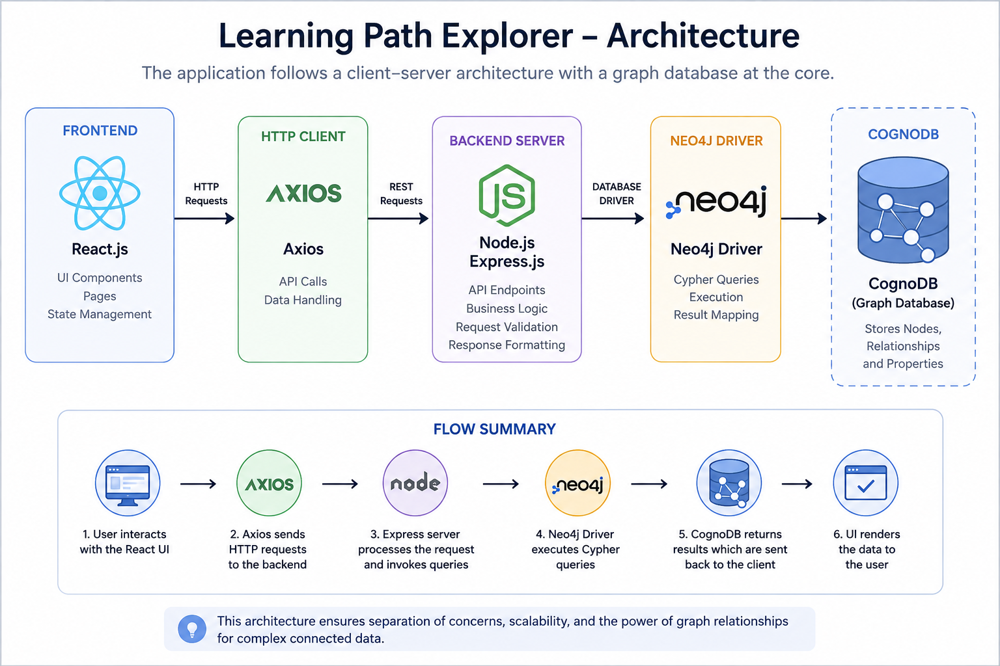
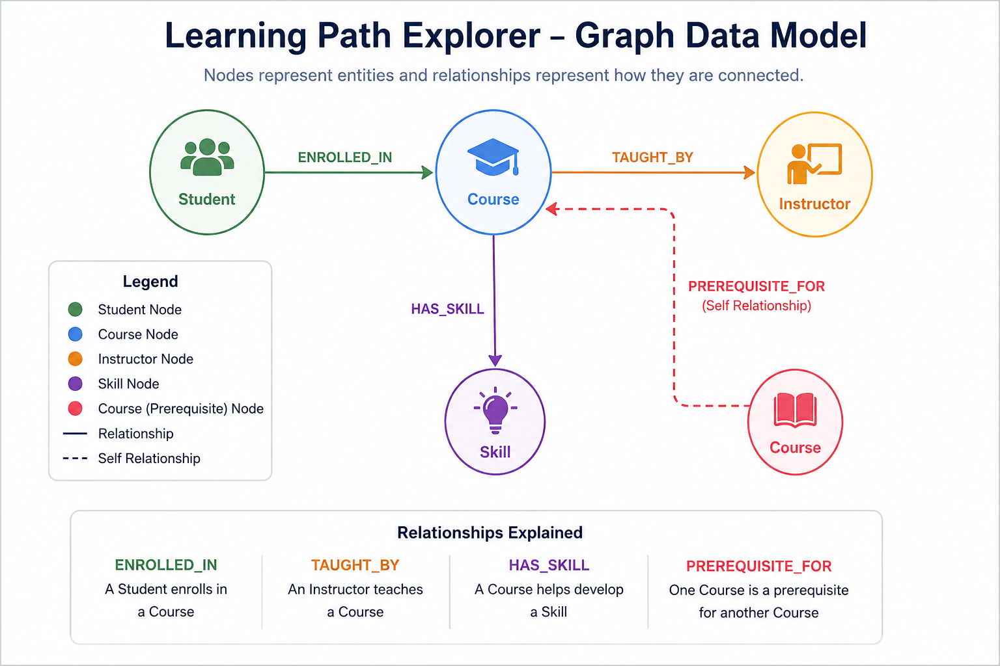
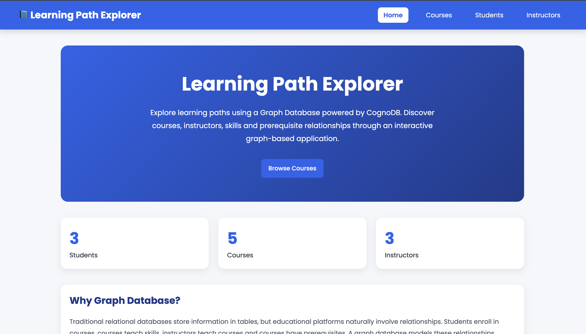
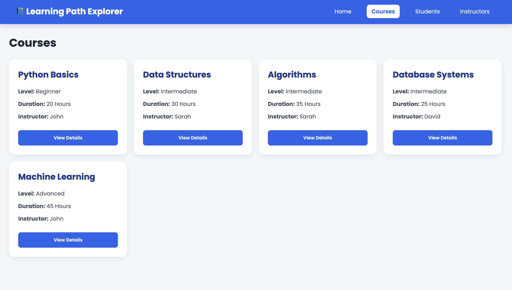
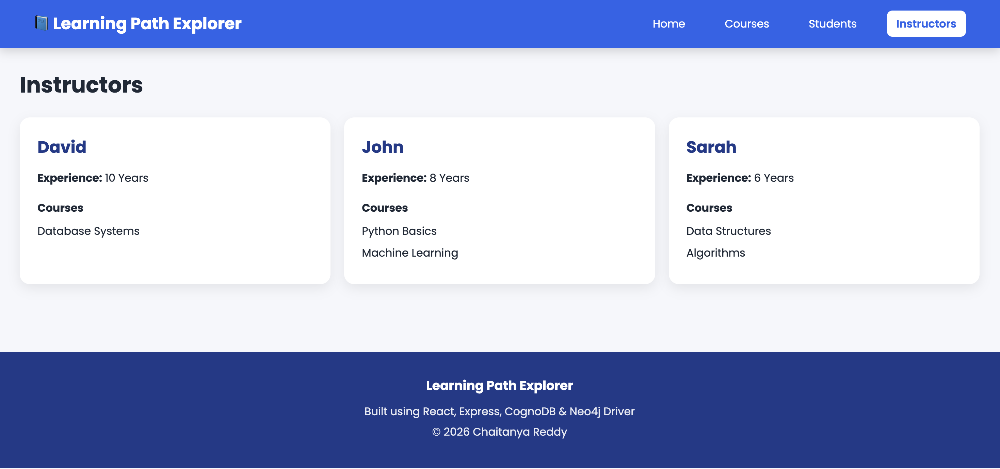
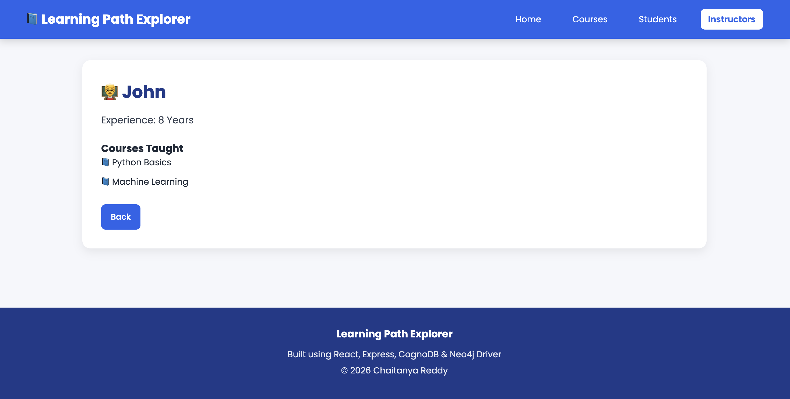

# 📘 Learning Path Explorer

A full-stack graph database application built using **React**, **Express.js**, **CognoDB**, and the **Neo4j JavaScript Driver**.

Learning Path Explorer demonstrates how graph databases can efficiently model and query highly connected educational data such as students, courses, instructors, skills, and prerequisite relationships.

Instead of storing relationships using multiple relational tables and complex JOIN operations, this application stores connections directly in a graph, making relationship traversal intuitive, scalable, and easy to understand.

---

# 🌐 Live Demo

> **Frontend:** _Coming Soon_

> **Backend API:** _Coming Soon_

---

# 🎥 Project Demo

> GitHub Release (Screen Recording): https://github.com/varalaChaitanya/Learning-path-explorer/releases/tag/v1.0.0

---

# 📖 Table of Contents

- Project Overview
- Features
- Technology Stack
- System Architecture
- Graph Data Model
- Why Graph Database?
- Folder Structure
- API Endpoints
- Main Cypher Queries
- Installation
- CognoDB Setup
- Environment Variables
- Running the Application
- Screenshots
- Future Improvements
- Author

---

# 📚 Project Overview

Learning Path Explorer is a graph-based educational platform that enables users to explore relationships between students, courses, instructors, skills, and prerequisite learning paths.

The application demonstrates how graph databases naturally represent interconnected educational data.

Users can:

- Browse available courses
- View detailed information for each course
- Explore prerequisite learning paths
- View students and their enrolled courses
- Enroll students into courses
- Explore instructors
- View detailed instructor profiles and courses taught
- Understand relationships using graph traversal

The project uses **CognoDB Cloud** as the graph database and communicates with it using the official **Neo4j JavaScript Driver** over the Bolt protocol.

---

# ✨ Features

- 📘 Browse all available courses
- 📖 View detailed course information
- 🛤️ Explore prerequisite learning paths
- 👨‍🎓 View students and their enrolled courses
- ➕ Enroll a student into a course
- 👨‍🏫 Explore instructors and their courses
- 📄 View instructor details
- 🏷️ View skills associated with each course
- ⚡ Graph-based relationship traversal using Cypher
- 🌐 RESTful API built with Express.js
- 💻 Responsive React frontend
- ☁️ Cloud-hosted graph database using CognoDB

# 🛠 Technology Stack

| Category | Technology |
|----------|------------|
| Frontend | React.js (Vite) |
| Styling | CSS3 |
| Backend | Node.js |
| Framework | Express.js |
| Database | CognoDB Cloud |
| Graph Driver | Neo4j JavaScript Driver |
| Query Language | Cypher |
| API Communication | Axios |
| Routing | React Router DOM |

---

# 🏗 System Architecture

The application follows a client-server architecture.

```
React Frontend
       │
       ▼
Axios HTTP Requests
       │
       ▼
Express.js REST API
       │
       ▼
Neo4j JavaScript Driver
       │
       ▼
CognoDB Cloud
```

### Architecture Diagram

> Replace the image below with your downloaded architecture image.

```md

```

---

# 🕸 Graph Data Model

The application stores educational entities as graph nodes and their relationships using graph edges.

### Nodes

- Student
- Course
- Instructor
- Skill

### Relationships

- ENROLLED_IN
- TAUGHT_BY
- HAS_SKILL
- PREREQUISITE_FOR

### Graph Diagram

```md

```

---

# 💡 Why a Graph Database?

This application revolves around **relationships** rather than isolated records.

Traditional relational databases require multiple JOIN operations to answer questions such as:

- Which courses should a student learn next?
- Which instructor teaches prerequisite courses?
- What is the complete prerequisite chain before Machine Learning?
- Which skills are covered throughout a learning path?

Graph databases represent these relationships directly.

Using **CognoDB**, traversing multiple connected nodes requires simple Cypher queries instead of deeply nested SQL JOINs.

Graph databases provide:

- Faster relationship traversal
- Natural representation of connected data
- Simpler multi-hop queries
- Better scalability for relationship-heavy applications

For an educational learning platform where entities are highly interconnected, a graph database is a better fit than a traditional relational database.

---

# 📂 Project Folder Structure

```text
Learning-Path-Explorer/
│
├── client/
│   ├── public/
│   ├── src/
│   │   ├── components/
│   │   ├── pages/
│   │   ├── services/
│   │   ├── App.jsx
│   │   ├── main.jsx
│   │   └── index.css
│   ├── package.json
│   └── vite.config.js
│
├── server/
│   ├── config/
│   ├── controllers/
│   ├── queries/
│   ├── routes/
│   ├── seed/
│   ├── app.js
│   ├── server.js
│   ├── package.json
│   └── .env
│
├── docs/
│   ├── DataModel.png
│   ├── LPE.png
│   ├── home-page.png
│   ├── courses-page.png
│   ├── course-details-page.png
│   ├── students-page.png
│   └── instructors-page.png
│
└── README.md
```

---

# 🌐 REST API Endpoints

## Courses

| Method | Endpoint | Description |
|---------|----------|-------------|
| GET | `/courses` | Retrieve all courses |
| GET | `/courses/:courseId` | Retrieve details of a specific course |
| GET | `/courses/:courseId/path` | Retrieve the prerequisite learning path |

---

## Students

| Method | Endpoint | Description |
|---------|----------|-------------|
| GET | `/students` | Retrieve all students |
| POST | `/students/enroll` | Enroll a student into a course |

Example Request Body

```json
{
  "studentId": "S001",
  "courseId": "C003",
  "status": "In Progress",
  "progress": 30
}
```

---

## Instructors

| Method | Endpoint | Description |
|---------|----------|-------------|
| GET | `/instructors` | Retrieve all instructors |
| GET | `/instructors/:instructorId` | Retrieve a specific instructor |

---

# 🔍 Main Cypher Queries

The application uses **Cypher**, the query language for graph databases, to retrieve connected data.

---

## 1. Fetch All Courses

Purpose

Retrieve all available courses along with their instructor and associated skills.

```cypher
MATCH (c:Course)

OPTIONAL MATCH (c)-[:TAUGHT_BY]->(i:Instructor)

OPTIONAL MATCH (c)-[:HAS_SKILL]->(s:Skill)

RETURN
c,
i,
collect(s)
```

---

## 2. Retrieve Course Details

Purpose

Retrieve detailed information for a single course, including:

- Instructor
- Skills
- Prerequisite Courses
- Next Courses

This query demonstrates traversing multiple relationships from a single node.

---

## 3. Learning Path Traversal

Purpose

Retrieve the prerequisite chain for a selected course.

Example

```
Python Basics
      │
      ▼
Data Structures
      │
      ▼
Algorithms
      │
      ▼
Machine Learning
```

This is a **multi-hop graph traversal**, one of the primary strengths of graph databases.

---

## 4. Student Enrollments

Purpose

Retrieve students along with the courses they are enrolled in.

The graph model enables direct traversal from Student nodes to Course nodes using the `ENROLLED_IN` relationship.

---

## 5. Instructor Directory

Purpose

Retrieve instructors and the courses they teach using the `TAUGHT_BY` relationship.

---

# ⚙ Installation

## Clone the Repository

```bash
git clone https://github.com/<your-username>/Learning-Path-Explorer.git

cd Learning-Path-Explorer
```

---

## Backend Setup

```bash
cd server

npm install
```

---

## Frontend Setup

```bash
cd client

npm install
```

---

# ☁ CognoDB Setup

1. Create a free account at **CognoDB Cloud**.
2. Create a **Free (c0)** database instance.
3. Copy the generated connection URI.
4. Copy the generated password.
5. Create a `.env` file inside the `server` folder.
6. Update the environment variables.
7. Run the seed script to populate the database.

---

# 🔐 Environment Variables

Create a `.env` file inside the **server** folder.

```env
DB_URI=bolt+s://your-instance-id.databases.cognodb.cloud
DB_USERNAME=cognodb
DB_PASSWORD=your_password
PORT=5000
```

---

# 🌱 Seed the Database

```bash
node seed/seed.js
```

This script:

- Creates Student nodes
- Creates Course nodes
- Creates Instructor nodes
- Creates Skill nodes
- Establishes graph relationships

---

# ▶ Running the Application

## Backend

```bash
cd server

npm run dev
```

---

## Frontend

```bash
cd client

npm run dev
```


---

# 📸 Application Screenshots

## Home Page

The landing page introduces the application and provides an overview of the Learning Path Explorer.



---

## Courses Page

Displays all available courses along with their level, duration, instructor, and navigation to course details.



---

## Course Details

Displays detailed information about a course including:

- Course Information
- Instructor
- Skills Covered
- Prerequisites
- Next Courses


---

## Students Page

Displays all students along with their enrolled courses and progress.


---

## Instructors Page

Displays instructors and the courses they teach.



---


## Instructor Details

Displays detailed information about an instructor, including years of experience and all courses taught by the instructor.



---

# 🚀 Deployment

The project can be deployed using free hosting services.

## Frontend

Deploy using **Vercel**

Live URL

```
https://your-frontend.vercel.app
```

---

## Backend

Deploy using **Render**

API URL

```
https://your-backend.onrender.com
```

---

## Database

CognoDB Cloud

---

# 📈 Future Improvements

The current implementation demonstrates graph database concepts for educational data.

Possible future enhancements include:

- User Authentication
- Student Login Dashboard
- Search and Filtering
- Course Recommendation Engine
- Interactive Graph Visualization
- Student Progress Analytics
- Admin Dashboard
- Course Completion Certificates
- Pagination
- Dark Mode

---

# 🎯 Learning Outcomes

This project demonstrates:

- Graph Database Design
- Cypher Query Language
- Graph Traversal
- REST API Development
- React Frontend Development
- Express.js Backend Development
- Neo4j JavaScript Driver
- CognoDB Cloud Integration

---

# 👨‍💻 Author

**Chaitanya Reddy**

B.Tech Computer Science Engineering (AI & ML)

Full Stack Developer

GitHub:

```
https://github.com/your-github
```

LinkedIn:

```
https://linkedin.com/in/your-linkedin
```

---

# 🙏 Acknowledgements

This project was developed as part of the **WEXA AI Candidate Take-Home Assignment**.

Special thanks to:

- WEXA AI
- CognoDB Cloud
- Neo4j Driver Documentation
- React Documentation
- Express.js Documentation

---

# ⭐ Conclusion

Learning Path Explorer demonstrates how graph databases simplify the modeling and querying of highly connected educational data.

Using CognoDB and Cypher, the application efficiently represents relationships between students, courses, instructors, skills, and prerequisite learning paths.

This project showcases practical graph database concepts through a complete full-stack web application built with React, Express.js, and CognoDB.
